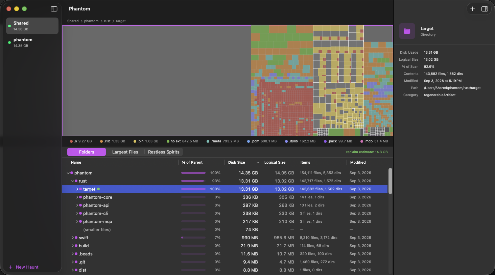

# Phantom



**A disk-space scanner built to be driven by AI agents.** Every capability —
scan, treemap, per-type breakdown, largest files, reclaimability
classification, scan-to-scan diff — is exposed over a local HTTP API **and**
an MCP server. An agent can drive the entire tool from day one; the Mac app
is one client of that API, not a GUI with scripting bolted on afterward.

"Clean up my Mac" is exactly the chore you want to hand to an agent. That
only works if the agent can reach *everything* the human UI can, and if the
numbers are trustworthy enough to act on and the tool never deletes anything
on its own. Phantom is built for all three.

## Agent-first, not agent-eventually

One local Rust API server owns the scan database; the app, the `phantom`
CLI, and the MCP server are peer clients reading the same persisted results.
Nothing lives only in the GUI.

- **MCP server** — `scan_directory`, `list_scans`, `find_large_files`,
  `get_space_by_type`, `get_treemap`, `get_hotspots`, `diff_scans`, `health`.
  The full surface, with the same authority the app has.
- **`phantom` CLI** — `--json` on every read, stable exit codes; scriptable
  without a model in the loop.
- **HTTP API** — the contract both of the above speak; documented to the
  byte in `open-prompt-edition/`.

An end-to-end harness asserts the CLI, raw HTTP, and MCP views of the same
scan match **byte-for-byte** on every push — so an agent, a script, and the
app never disagree about a number. Everything is local: the API binds
127.0.0.1 only, key-file auth, zero egress (`docs/threat-model.md`).

## Trustworthy enough for an agent to act on

An agent acting on wrong numbers deletes the wrong things, so the accuracy
and the safety posture are load-bearing, not nice-to-haves:

- **Real occupied size, not apparent size.** `du` reports a
  cloud-dataloaded OneDrive tree as 147 MB while it occupies ~0 physical
  blocks, and a hardlinked `~/.cache/uv` as 17 GB that frees only 5. Phantom
  measures `st_blocks × 512` everywhere and dedupes hardlinks by
  `(dev, ino)` — its reclaim estimate is what deletion would actually return.
- **Phantom never deletes.** It classifies each hotspot — regenerable build
  artifacts (`target/`, `node_modules`, DerivedData), tool-managed caches,
  cloud placeholders, stale-project artifacts — and surfaces the *safe*
  command (`cargo clean`, `brew cleanup`, `npm cache clean`). You, or your
  agent, decide and execute. There is no destructive operation to
  mis-trigger.
- **Staleness from source, not artifacts.** Project dormancy is judged from
  full-depth *source* mtimes (`cargo sweep` touches `target/` on every run,
  so artifact mtimes lie), and "unknown" is never "stale".

## Install

Requires macOS 14 (Sonoma) or later, Apple Silicon.

**[Download the latest release →](https://github.com/tedswinyar/phantom/releases/latest)**

Open the DMG, drag Phantom to Applications, and launch. It's Developer
ID-signed and notarized, so it opens without Gatekeeper warnings, and it
keeps itself current via Sparkle (EdDSA-signed updates; it asks before
checking).

Then point an agent at it by registering the bundled MCP server (`.mcp.json`
shows the shape), or drive it from a shell:

```bash
phantom scan ~/Code     # CLI (in Phantom.app/Contents/Helpers/phantom)
phantom hotspots        # the reclaimable summary, straight to your terminal
phantom hotspots --json # …the same data an agent or script consumes
```

## Build from source

Contributors and Intel Macs (unsupported by the release build) can build the
app locally — see [`docs/getting-started.md`](docs/getting-started.md):

```bash
git clone https://github.com/tedswinyar/phantom.git && cd phantom
make app && open build/Phantom.app
```

## Documentation

| | |
|---|---|
| Tour (clone → app in 10 minutes) | `docs/getting-started.md` |
| The reclaimability taxonomy and measurement rules | `docs/reclaimability.md` |
| Architecture (one hub, thin clients) | `docs/adr/0001-constellation-architecture.md` |
| Wire contract + rebuild kit (Open Prompt Edition) | `open-prompt-edition/` |
| Threat model / security posture | `docs/threat-model.md`, `SECURITY.md` |

## License

MIT — see `LICENSE`. Third-party attributions: `THIRD-PARTY-NOTICES.html`.
